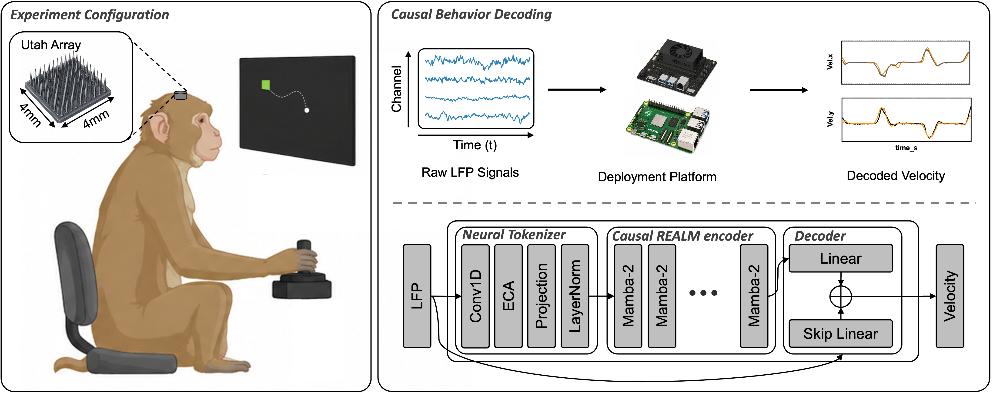
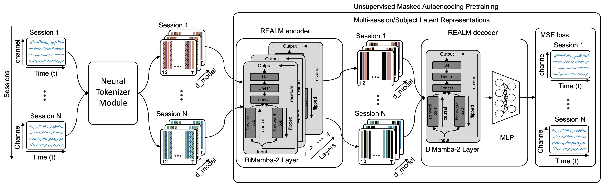
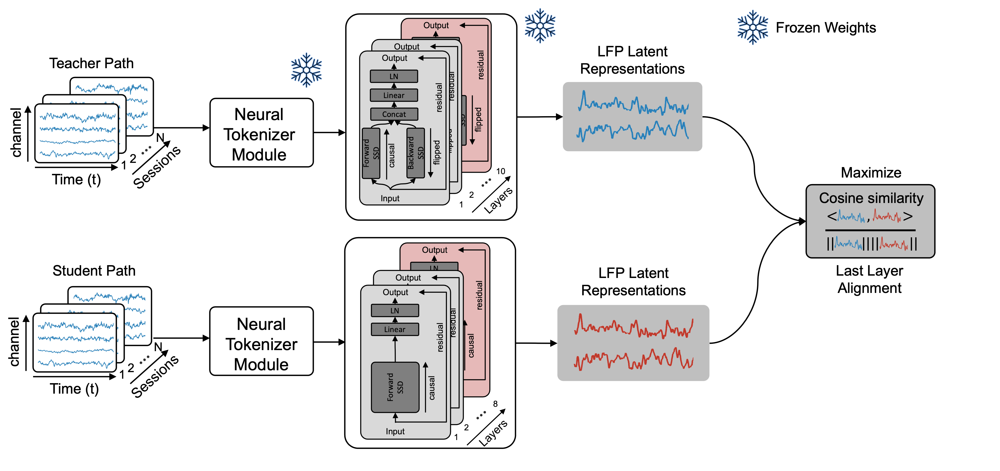

# REALM: Retrospectively-Distilled Causal Mamba-2 for Real-Time Neural Decoding

Code + checkpoints accompanying the paper.

## Configuration

Real-time inference configuration:



In both datasets, a monkey performs a 2D reaching task with a planar manipulandum while broadband **local field potentials (LFP)** are recorded from a 4×4 mm, 96-channel Utah array implanted in primary motor cortex (M1) and streamed at 100 Hz. The task differs across datasets: in **Makin** (Monkey I, Indy) targets appear at continuously varying random positions on the screen, so reaches are self-paced and sequential; in **Flint** (Monkey C) targets are drawn from a fixed set of radial locations around a center hold, giving the standard 8-direction center-out paradigm. At inference time, each incoming LFP frame is passed through a shared **Neural Tokenizer** (Conv1D → ECA channel attention → linear projection → LayerNorm), a stack of **causal Mamba-2** blocks, and a lightweight linear + skip-linear decoder that outputs 2D end-effector velocity (vₓ, vᵧ). Because the encoder is strictly causal and Mamba-2 admits O(1) per-step recurrent inference, the full pipeline runs in well under 10 ms on commodity edge devices (Raspberry Pi 5 / Jetson Orin Nano), meeting the 100 Hz budget required for closed-loop BCI control.

## Demo

Real-time decoding from broadband LFP. Each clip shows the input LFP channels (left), predicted vs. ground-truth velocity (middle), and the reconstructed 2D cursor trace (right). Model: REALM (4.9M) 5-Fold Ensemble.

**Makin (Monkey I)**


**Flint (Monkey C)**


## Methodology

REALM is trained in three stages:

1. **Unsupervised pretraining.** A bidirectional Mamba-2 teacher is pretrained on **130 hours of LFP** with a Continuous Masked Autoencoding (CMAE) objective — random temporal spans are masked and reconstructed in the continuous LFP space, yielding session-agnostic representations.

   

2. **Retrospective distillation.** A causal Mamba-2 student is distilled from the frozen teacher under two jointly optimized objectives: a **representation-level cosine alignment** loss between the student's last-layer hidden states and the teacher's, and a downstream **velocity-reconstruction** loss. The bidirectional teacher provides the "future-aware" supervision the causal student cannot see at inference time.

   

3. **Per-session finetuning.** The distilled causal student is briefly finetuned on each held-out session to adapt to subject- and session-specific neural variability.

## Highlights

- **Bidirectional teacher → causal student** retrospective distillation
- **Mamba-2** backbone with O(1) per-step recurrent inference (real-time on CPU / Jetson)
- 3 causal sizes (REALM-S 2.1M / REALM 4.9M / REALM-L 10.5M) + 2 bidirectional references (REALM-bi 5M, REALM-Lbi 10.9M)
- 5-fold disjoint stacking ensemble (free +0.025–0.043 R² lift, no extra training)

## Setup

```bash
pip install -r requirements.txt
```

Tested on Python 3.9+, PyTorch ≥ 2.0. Pure PyTorch — no `mamba_ssm` CUDA kernel needed, so CPU and Jetson inference work out of the box.

## Quick inference (uses bundled checkpoint)

```bash
# 80/20 supervised finetune per session
python scripts/inference.py --ckpt checkpoints/realm_makin.pt \
    --datasets makin --finetune --train_ratio 0.8

# Zero-shot from distillation (no per-session finetune)
python scripts/inference.py --ckpt checkpoints/realm_makin.pt --datasets makin
```

## Reproducing the pipeline (3 stages)

```bash
# 1. Unsupervised teacher pretrain (masked-LFP)
python scripts/pretrain.py --datasets makin --epochs 200 --batch_size 16 \
    --tag teacher_m1only

# 2. Retrospective distillation: teacher → causal/bidir student
python scripts/distill.py --pretrained checkpoints/teacher_m1only.pt \
    --student_size realm --datasets makin --loss_type realm \
    --lambda_repr 1.0 --lambda_ae 0.1 --align_layers 1 \
    --epochs 300 --patience 30 --tag distill_realm_makin
# --student_size: realm_s | realm | realm_l | realm_bi | realm_lbi

# 3. Per-session supervised finetune
python scripts/finetune.py --pretrained checkpoints/realm_makin.pt \
    --datasets makin --train_ratio 0.8 --freeze_layers 0 --epochs 150 --tag eval
```

## Data

Public Makin (`real_lfp_makin`) and Flint (`real_lfp_flint`) datasets, broadband LFP at 100 Hz. Place processed `.npz` per session under `data/Makin/` and `data/Flint/` — see `utils/dataset.py` for the expected layout. Released checkpoints are trained on the Makin subset (29 sessions, 5 held out); Flint and multi-dataset runs use the same scripts.

## Architectures

| Name | Params | Direction | Use case |
|---|---|---|---|
| REALM-S    |  2.1M | causal | Smallest — Jetson Nano latency-priority |
| REALM      |  4.9M | causal | Main causal model |
| REALM-L    | 10.5M | causal | Largest causal — accuracy priority |
| REALM-bi   |  5.0M | bidir  | Distilled bidir reference |
| REALM-Lbi  | 10.9M | bidir  | Bidirectional ceiling |
| Teacher    | 10.9M | bidir  | Pretrained backbone for distillation |

Each `*_makin.pt` ckpt stores `{'student_state_dict', 'encoder_kwargs', ...}` so the decoder rebuilds itself; checkpoints are ≤43 MB each (no Git LFS needed).

## Repo layout

```
.
├── models/        # Encoder / Decoder / Layers / Configs (pure PyTorch)
├── utils/         # Dataset loader, masked pretraining, distill losses
├── scripts/
│   ├── pretrain.py      Stage 1: masked-LFP pretrain (bidirectional teacher)
│   ├── distill.py       Stage 2: retrospective distillation (teacher → student)
│   ├── finetune.py      Stage 3: per-session supervised finetune
│   └── inference.py     Load ckpt + run inference (with optional FT)
├── checkpoints/   # 6 ready-to-use ckpts (Makin, seed=42)
├── figure/        # Demo GIFs + result plots
└── data/          # README only — datasets are external (see above)
```
