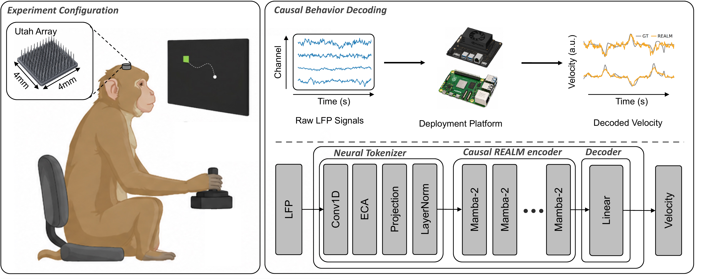
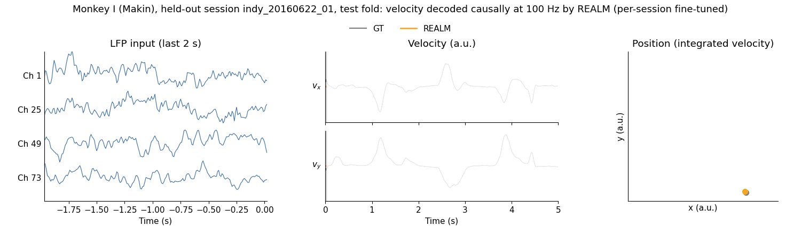
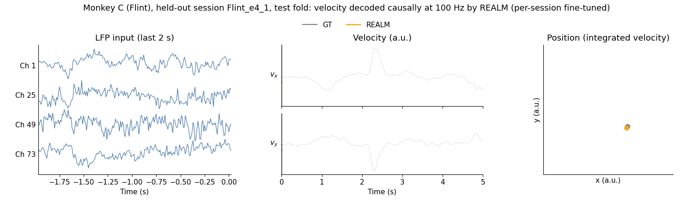
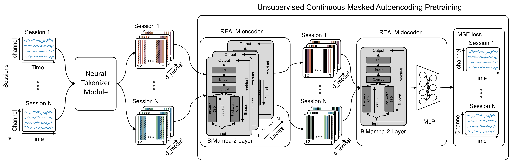
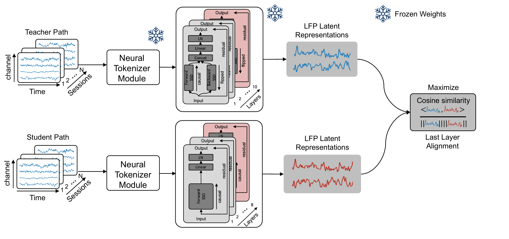

# REALM: Retrospective Encoder Alignment for LFP Modeling

Code and checkpoints for **REALM**, a causal decoder of arm velocity from intracortical local field
potentials (LFP). A bidirectional Mamba-2 teacher is pretrained on unlabeled LFP with continuous
masked autoencoding; its representations are then transferred to a causal Mamba-2 student by
**retrospective knowledge distillation (RKD)**, without any behavioral labels. The causal student
decodes one velocity estimate per incoming LFP sample at 100 Hz.

## Configuration



Two public datasets are used, both recorded with a 96-channel Utah array in primary motor cortex:
**Makin** (Monkey I; O'Doherty et al.), a self-paced sequential reaching task to random targets,
and **Flint** (Monkey C), a center-out task. The raw LFP is band-limited to 0.05-50 Hz and resampled
to 100 Hz. At inference time each LFP frame passes through the **Neural Tokenizer** (per-channel
temporal convolution, ECA channel attention, linear projection, LayerNorm), a stack of **causal
Mamba-2** layers, and a linear read-out of the 2D velocity.

## Demo

Each clip replays one held-out test segment (5 s at 100 Hz) in real time: the LFP input (left), the
velocity decoded by REALM after per-session fine-tuning against the recorded velocity (middle), and
the 2D position obtained by integrating each velocity (right). The segments are the ones shown in
the paper's trace panels.

**Makin (Monkey I), held-out session indy_20160622_01**



**Flint (Monkey C), held-out session Flint_e4_1**



## Method

1. **Masked pretraining of the teacher.** A bidirectional Mamba-2 (BiMamba-2) teacher (10 layers,
   11.5 M parameters) is pretrained with continuous masked autoencoding (CMAE) on the 34
   non-held-out sessions of Makin and Flint: blocks of 10-50 time steps covering 60% of each 5 s
   segment are masked and reconstructed in LFP space.

   

2. **Retrospective knowledge distillation.** A causal Mamba-2 student is distilled from the frozen
   teacher with two terms: a cosine alignment between the student's and the teacher's last-layer
   representations at every time step, and a reconstruction of the input LFP from the student's
   causal representation (lambda_repr = lambda_ae = 1). No behavioral label enters distillation
   (lambda_task = 0). One student is distilled per corpus.

   

3. **Evaluation on held-out sessions**, in two regimes:
   - *label-free*: the encoder stays frozen and a ridge read-out on the past 10 frames of its
     output is fitted on each held-out session;
   - *fine-tuned*: the encoder is adapted on each held-out session with velocity labels (the neural
     tokenizer stays frozen).

The same recipe with a bidirectional student gives **REALM-bi**, an offline (non-causal) reference.

## Results

Per-axis R² on the eight held-out sessions (five Makin, three Flint), each split 72/8/20 into
training, validation and test folds; mean over sessions and three seeds (42, 123, 456).

| Model | Params | Direction | Label-free | Fine-tuned |
|---|---|---|---|---|
| REALM    | 4.91 M | causal        | 0.561 (Makin 0.519, Flint 0.630) | 0.686 (Makin 0.677, Flint 0.701) |
| REALM-bi | 5.54 M | bidirectional | 0.588 (Makin 0.547, Flint 0.656) | - |

## Setup

```bash
pip install -r requirements.txt
```

Tested with Python 3.10 and PyTorch 2.8 on NVIDIA A100 GPUs. The Mamba-2 layers are written in pure
PyTorch, so no `mamba_ssm` CUDA kernels are needed and the models also run on CPU.

## Data

Download the public releases (see [data/README.md](data/README.md)), then build the 100 Hz LFP files
and the evaluation splits:

```bash
export REALM_DATA=/path/to/data          # defaults to ./data
python scripts/preprocess_makin.py       # -> $REALM_DATA/makin/preprocessed/lfp/*_rawlfp.npz
python scripts/preprocess_flint.py       # -> $REALM_DATA/flint/preprocessed/lfp/*_rawlfp.npz
python scripts/make_flint_tukey.py       # held-out Flint sessions, artifact windows removed
python scripts/make_splits.py            # optional: rebuilds splits/canonical_splits_728020.json
# the preprocessing scripts take --session <name> for a single session; --help lists all options
```

The held-out sessions are the eight used by CrossModalDistill: Makin `indy_20160622_01`,
`indy_20160630_01`, `indy_20160915_01`, `indy_20161013_03`, `indy_20170124_01` and Flint
`Flint_e1_1`, `Flint_e4_1`, `Flint_e5_2`. Each is cut into non-overlapping 5 s segments that are
split 72/8/20 by `splits/canonical_splits_728020.json`; the test fold is never used for fitting.

## Checkpoints

| File | Model | Trained on |
|---|---|---|
| `checkpoints/teacher.pt`        | BiMamba-2 teacher (11.50 M) | 34 non-held-out Makin + Flint sessions |
| `checkpoints/realm_makin.pt`    | REALM, causal (4.91 M)      | distilled on the Makin sessions |
| `checkpoints/realm_flint.pt`    | REALM, causal (4.91 M)      | distilled on the Flint sessions |
| `checkpoints/realm_bi_makin.pt` | REALM-bi (5.54 M)           | distilled on the Makin sessions |
| `checkpoints/realm_bi_flint.pt` | REALM-bi (5.54 M)           | distilled on the Flint sessions |

All students are the seed-42 models of the paper.

## Evaluate the released models

```bash
# label-free: frozen encoder + ridge read-out on each held-out session
python scripts/eval_labelfree.py --ckpt checkpoints/realm_makin.pt    --dataset makin --seed 42
python scripts/eval_labelfree.py --ckpt checkpoints/realm_bi_flint.pt --dataset flint --seed 42

# per-session supervised fine-tuning (the neural tokenizer stays frozen)
python scripts/finetune.py --ckpt checkpoints/realm_makin.pt --dataset makin --seed 42
```

Both scripts print the R² of every held-out session and write a JSON under `output/`. With the
released seed-42 checkpoints they reproduce the paper's seed-42 runs exactly:

| Model | Regime | Makin | Flint | All eight |
|---|---|---|---|---|
| REALM    | label-free | 0.520 | 0.624 | 0.559 |
| REALM-bi | label-free | 0.551 | 0.645 | 0.586 |
| REALM    | fine-tuned | 0.681 | 0.690 | 0.684 |

## Reproduce the pipeline

```bash
# 1. teacher: continuous masked autoencoding on the 34 non-held-out sessions
#    (paper: 16 GPUs x batch 24; the effective batch scales with the number of GPUs)
torchrun --nproc-per-node=<GPUs> scripts/pretrain.py --out output/teacher.pt

# 2. retrospective distillation, one student per corpus and seed
python scripts/distill.py --teacher output/teacher.pt --student realm    --dataset makin --seed 42
python scripts/distill.py --teacher output/teacher.pt --student realm_bi --dataset flint --seed 42

# 3. evaluation of each student, as above, for seeds 42, 123 and 456
```

Every script's defaults are the settings used in the paper; `--help` lists them. Training on GPU is
not bitwise reproducible from run to run (differences of order 1e-6 in the weights); with PyTorch's
deterministic mode the distillation reproduces the paper's runs bitwise.

## Repository layout

```
.
├── models/        Neural tokenizer, Mamba-2 / BiMamba-2 layers, encoder, read-out, configurations
├── utils/         Data loading and splits, block masking, distillation loss, augmentations
├── scripts/
│   ├── preprocess_makin.py   raw recordings -> 100 Hz LFP (Makin)
│   ├── preprocess_flint.py   raw recordings -> 100 Hz LFP (Flint)
│   ├── preprocessing_utils.py  filtering, re-referencing and resampling shared by both
│   ├── make_flint_tukey.py   artifact-window removal for the held-out Flint sessions
│   ├── make_splits.py        72/8/20 splits of the held-out sessions
│   ├── pretrain.py           stage 1: CMAE pretraining of the teacher
│   ├── distill.py            stage 2: retrospective distillation (REALM / REALM-bi)
│   ├── eval_labelfree.py     label-free ridge read-out on held-out sessions
│   └── finetune.py           per-session supervised fine-tuning
├── splits/        canonical 72/8/20 splits of the eight held-out sessions
├── checkpoints/   teacher, REALM and REALM-bi (seed 42)
├── figure/        configuration, method figures and demo GIFs
└── data/          README only; the datasets are downloaded separately
```

## Citation

```bibtex
@article{wu2026realm,
  title   = {{REALM}: Retrospective Encoder Alignment for {LFP} Modeling},
  author  = {Wu, Peicheng and Bu, Zhenyu and Ma, Runze and Du, Lin},
  journal = {arXiv preprint arXiv:2605.14867},
  year    = {2026}
}
```
